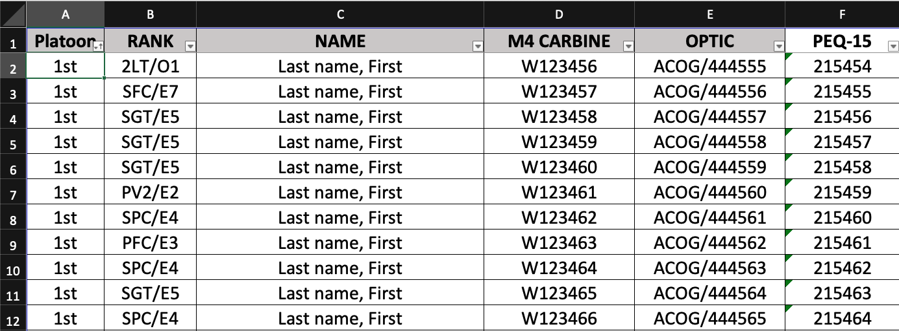
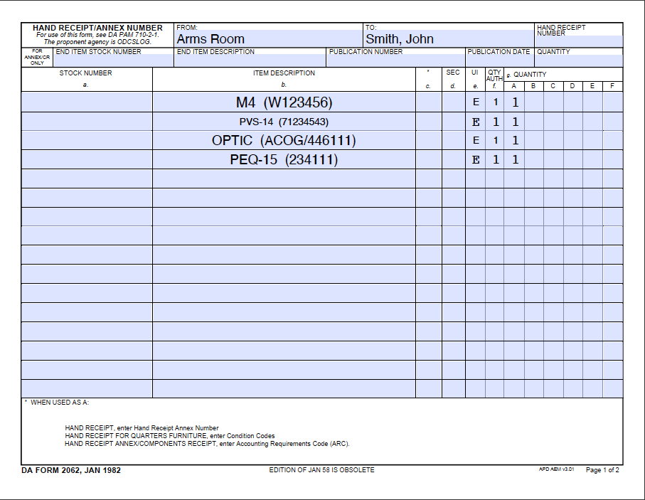

# mal_to_2062
This is a short python script for filling 2062s from a company Master Authorization List (MAL). A post explaining this project can be found [here](https://jschless.github.io/posts/fill-pdf-from-excel-file/). 

In short, I turn a spread sheed that looks like this:

 

into an Army form that looks like this:

This idea could be extended across many fillable government forms. 
